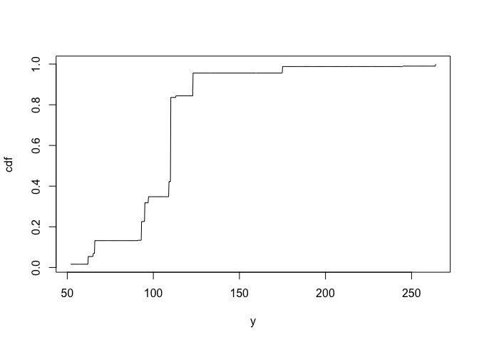

<!-- README.md is generated from README.Rmd. Please edit that file -->

# rainonsnow

<!-- badges: start -->

<!-- badges: end -->

`rainonsnow` is a research repository for exploring rain-on-snow
hydrology in the Alps, focussing on extreme runoff as a consequence.

The repo currently has two main pieces:

- A Python workflow for downloading hourly ERA5-Land variables from
  Google Earth Engine.
- An R package plus analysis script for fitting and inspecting
  distributional learning models on the exported data.

## Current Workflow

1.  Download gridded hydroclimate data with `scripts/download_data.py`.
2.  Save the resulting NetCDF file locally.
3.  Analyze the data and fit models from R with `scripts/analyze.r`.

The Python downloader writes `data/era5_land_hourly_alps.nc`, which
matches the path used by `scripts/analyze.r`.

## Python Setup

This repository uses `uv` for the Python environment.

``` bash
uv sync
```

The Python dependencies are declared in `pyproject.toml`.

## Download Data

The downloader script initializes Earth Engine, queries the
`ECMWF/ERA5_LAND/HOURLY` image collection for an Alps bounding box,
selects a small set of snow, precipitation, temperature, and runoff
variables, and exports the result to NetCDF.

Before running it, make sure you have authenticated with Google Earth
Engine and that the project in `scripts/download_data.py` is valid for
your account:

``` bash
earthengine authenticate
```

Run the script with:

``` bash
uv run python scripts/download_data.py
```

## R Setup

The R side of the repository is structured like a package, with source
files in `R/`, documentation in `man/`, and package metadata in
`DESCRIPTION` and `NAMESPACE`.

Install the required R packages as needed, then load the package locally
during development:

``` r
devtools::load_all()
```

## Run The Analysis

Open `scripts/analyze.r` in R and run it interactively, or source it
from an R session.

The script currently:

- Loads the NetCDF file with `terra::rast()`
- Converts the raster stack into a tabular format
- Fits a distributional learning model per cell
- Generates predictions from the fitted models

## Shiny apps

Interactive apps live under `apps/*/app.R`. Run them from the
**repository root** so paths such as `data/` and `devtools::load_all()`
resolve:

``` r
shiny::runApp("apps/<app-folder>")
```

Typical dependencies include [shiny](https://shiny.posit.co/),
**ggplot2**, **tidyverse**, **sf**, and **rnaturalearth**; individual apps
may need **yaml**, **probaverse**, **distionary**, **famish**,
**rvinecopulib**, and others used in the analysis scripts.

### POT explorer (`apps/pot-explorer`)

Inspect **peaks over threshold (POT)** extraction: hourly runoff for one
grid cell and year, the POT threshold line, and peak events in the POT
sample. Pick the cell from a map or the sidebar.

**Data:** `data/era5_land_hourly_alps_all.rds`
(`scripts/2-tablify_spatial_eo.r`) and `data/era5_land_hourly_alps_peaks.rds`
(`scripts/3-pot_spatial_eo.r`).

``` r
shiny::runApp("apps/pot-explorer")
```

### DL diagnostics explorer (`apps/dl-diagnostics-explorer`)

Calibration (P–P), skill versus marginal fit, and rain–snow scatter with
conditional runoff CDFs at clicked coordinates.

**Data:** POT peaks, distributional-learning predictions, and fitted
models from script 4 — e.g. `data/era5_land_hourly_alps_peaks.rds`,
`data/era5_land_hourly_alps_dl_predictions.rds`,
`data/era5_land_hourly_alps_dl_rqforest_models.rds`.

``` r
shiny::runApp("apps/dl-diagnostics-explorer")
```

### Return-level explorer (`apps/return-level-explorer`)

Map of marginal runoff return levels by cell, frequency–magnitude curves
(forest mixture vs GP tail), and rain–snow likelihood surfaces at a
chosen return period.

**Data:** peaks from script 3; script 4 models; precomputed marginal
return levels from script 5 (`data/era5_land_hourly_alps_dl_marginal_return_levels.rds`
or the bundle described in the app header), or
`data/era5_land_hourly_alps_dl_predictions.rds` as a slower fallback.

``` r
shiny::runApp("apps/return-level-explorer")
```

### Joint rainfall–snowmelt explorer (`apps/joint-rain-snow-explorer`)

Marginal fits and copula per cell: Gaussian-score diagnostics, joint
density contours, marginal histograms, and frequency–magnitude curves
for rainfall and snowmelt. Optional re-run of joint fitting from the
sidebar (writes `inputs/joint_rain_snow_metadata.yaml` and runs
`scripts/6-drivers_joint_distribution.r`).

**Data:** `data/era5_land_hourly_alps_all.rds` and joint output from
script 6 (`data/era5_land_hourly_alps_joint_rain_snow.rds`); metadata in
`inputs/joint_rain_snow_metadata.yaml`.

``` r
shiny::runApp("apps/joint-rain-snow-explorer")
```

### Runoff marginals explorer (`apps/runoff-marginals-explorer`)

Side-by-side frequency–magnitude curves: distributional-learning
marginals (Random Forest mixture vs GP conversion) and **naive** POT-only
marginals (`distionary::dst_empirical` vs `famish::fit_dst_gp` on peak
runoff). Map cell selection; optional matched *y*-axis limits and log
return level on both panels.

**Data:** `data/era5_land_hourly_alps_peaks.rds` and
`data/era5_land_hourly_alps_dl_return_levels.rds` from
`scripts/5-runoff_marginals.r`.

``` r
shiny::runApp("apps/runoff-marginals-explorer")
```

## R Package Contents

``` r
library(rainonsnow)
library(dplyr)
#> 
#> Attaching package: 'dplyr'
#> The following objects are masked from 'package:stats':
#> 
#>     filter, lag
#> The following objects are masked from 'package:base':
#> 
#>     intersect, setdiff, setequal, union
```

The R package part of the repository provides a small distributional
learning interface for modelling the distribution of a target variable
given some predictors.

For a simple workflow, fit a model with `dl_rqforest()` and then call
`predict()`, using the `mtcars` dataset from the stats package.

``` r
df <- as_tibble(mtcars)
model <- dl_rqforest(
  data = df,
  yname = "hp",
  xnames = c("wt", "drat", "gear")
)

df <- mutate(df, distribution = predict(model), .before = everything())
df
#> # A tibble: 32 × 12
#>    distribution   mpg   cyl  disp    hp  drat    wt  qsec    vs    am  gear
#>    <list>       <dbl> <dbl> <dbl> <dbl> <dbl> <dbl> <dbl> <dbl> <dbl> <dbl>
#>  1 <dst>         21       6  160    110  3.9   2.62  16.5     0     1     4
#>  2 <dst>         21       6  160    110  3.9   2.88  17.0     0     1     4
#>  3 <dst>         22.8     4  108     93  3.85  2.32  18.6     1     1     4
#>  4 <dst>         21.4     6  258    110  3.08  3.22  19.4     1     0     3
#>  5 <dst>         18.7     8  360    175  3.15  3.44  17.0     0     0     3
#>  6 <dst>         18.1     6  225    105  2.76  3.46  20.2     1     0     3
#>  7 <dst>         14.3     8  360    245  3.21  3.57  15.8     0     0     3
#>  8 <dst>         24.4     4  147.    62  3.69  3.19  20       1     0     4
#>  9 <dst>         22.8     4  141.    95  3.92  3.15  22.9     1     0     4
#> 10 <dst>         19.2     6  168.   123  3.92  3.44  18.3     1     0     4
#> # ℹ 22 more rows
#> # ℹ 1 more variable: carb <dbl>
```

The predictions are distributions. Take a look at the first distribution
using the probaverse, for example, and plot its cdf.

``` r
plot(df$distribution[[1]], n = 1000)
```



The package also includes a null model to handle failures gracefully.
For example, if you ask for `na_action = "null"` and the training data
contain missing values, or if the training fails, `dl_rqforest()`
returns a `dl_null` object instead of failing:

``` r
df2 <- as_tibble(mtcars)
df2$wt[2] <- NA_real_

dl_rqforest(
  data = df2,
  yname = "hp",
  xnames = c("wt", "drat", "gear")
)
#> <dl_rqforest>
#> response: hp
#> predictors: 3
#> training rows: 31
```

Predicting on these objects always returns a null distribution with the
number of rows of the data:

``` r
predict(dl_null(), newdata = tibble(x = 1:2))
#> [[1]]
#> Null distribution (NA) 
#> 
#> [[2]]
#> Null distribution (NA)
```

## Repository Layout

``` text
.
├── R/
├── man/
├── apps/
│   ├── dl-diagnostics-explorer/
│   ├── joint-rain-snow-explorer/
│   ├── pot-explorer/
│   ├── return-level-explorer/
│   └── runoff-marginals-explorer/
├── scripts/
│   ├── analyze.r
│   └── download_data.py
├── data/
├── main.py
├── DESCRIPTION
├── NAMESPACE
└── pyproject.toml
```

## Status

This repository is in an active research/prototyping state, so scripts,
paths, and interfaces may change as the workflow evolves.
