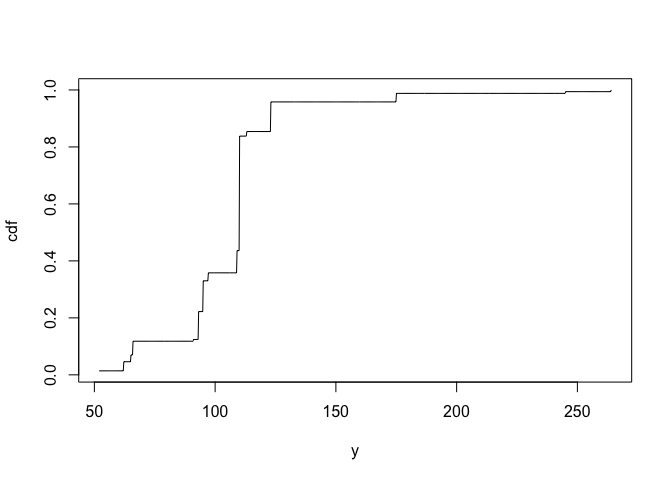

<!-- README.md is generated from README.Rmd. Please edit that file -->

# rainonsnow

<!-- badges: start -->

<!-- badges: end -->

`rainonsnow` is a research repository for exploring rain-on-snow
hydrology in the Alps, focussing on extreme runoff as a consequence.

The repo consists of:

- A code pipeline for bringing in raster data from Google Earth Engine
  and analyzing it.
- A set of Shiny apps for exploring the data and models.
- An R package for the distributional learning model and helper
  functions.

## Current Workflow

Scripts are numbered in pipeline order (`scripts/1-*` … `scripts/7-*`).
Intermediate files land under `derived/` (and yearly NetCDF under
`derived/eo/`).

1.  **`scripts/1-download_data-eo.py`** — Download hourly ERA5-Land from
    Google Earth Engine to `derived/eo/era5_land_hourly_alps_<year>.nc`
    (bands and years from `inputs/data_specifications.yaml`).
2.  **`scripts/2-tablify_spatial_eo.r`** — Raster NetCDF → tabular
    hourly series; writes `derived/era5_land_hourly_alps_all.rds`.
3.  **`scripts/3-pot_spatial_eo.r`** — Peaks over threshold per cell
    (`derived/era5_land_hourly_alps_peaks.rds`, thresholds, metadata).
4.  **`scripts/4-distributional_learning.r`** — Quantile regression
    forest on POT peak hours (models and predictions used by later
    apps).
5.  **`scripts/5-runoff_marginals.r`** — Marginal return-level tables
    for runoff (`derived/era5_land_hourly_alps_dl_*`).
6.  **`scripts/6-drivers_joint_distribution.r`** — Joint
    rainfall–snowmelt model per cell.
7.  **`scripts/7-likeliest_rain_snow.r`** — Conditional rain–snow
    structure given extreme runoff (optional follow-on).

## Dependency management

Python dependencies are managed with
**[uv](https://github.com/astral-sh/uv)** (`pyproject.toml`; run
`uv sync` so the lockfile matches the resolved environment). R package
dependencies are declared in `DESCRIPTION`; install them from the repo
root with something like `devtools::install_deps()` (or your preferred
workflow). While editing package code, `devtools::load_all()` attaches
the package from source.

## Python Setup

This repository uses `uv` for the Python environment.

``` bash
uv sync
```

The Python dependencies are declared in `pyproject.toml`.

## Data specifications (`inputs/data_specifications.yaml`)

Pipeline settings for ERA5-Land export and tabular cleanup live in
**`inputs/data_specifications.yaml`**:

- **`earth_engine.project_id`** — Google Cloud project passed to
  `ee.Initialize(project=...)`.
- **`download`** — Earth Engine **`collection_id`**, **`first_year`** /
  **`last_year`**, and **`variables`** (hourly band names exported from
  the collection).
- **`tablify.epsilon_mm`** — Near-zero cutoff for rain and melt (mm/h
  equivalent) in script 2 before other steps.

Authentication is separate from this file: run once per machine/user:

``` bash
earthengine authenticate
```

Run the downloader with:

``` bash
uv run python scripts/1-download_data-eo.py
```

If `data_specifications.yaml` is missing, scripts 1 and 2 fall back to
the same defaults as the template file.

## Input Controls

YAML files under **`inputs/`** configure scripts and apps (beyond
`data_specifications.yaml` above):

- **`distributional_learning.yaml`** — Response and predictors for
  **`dl_rqforest`** in script 4.
- **`rain_snow_joint_model.yaml`** — Joint marginal + copula options for
  script 6 (key `fit_joint_rain_snow_cells`), and
  **`likeliest_rain_snow`** settings for script 7 (conditional rain–snow
  surface given runoff).
- **`pot_metadata.yaml`** — POT quantile / min-gap for script 3 and
  `apps/3-pot-explorer`.

## R Setup

In addition to the analysis stream of this repository, this repository
is also structured like an R package, with source files in `R/`,
documentation in `man/`, and package metadata in `DESCRIPTION` and
`NAMESPACE`. This is useful so that custom functions can be more easily
accessed by the analysis scripts, and more easily used by anyone
developing this analysis.

To make these functions available to the analysis scripts, run:

``` r
devtools::load_all()
```

If you make a change to the R package, run `devtools::document()` to
update the package documentation.

## Run The Analysis

Run the scripts in order (each writes inputs for the next) from the repo
root.

``` bash
uv python scripts/1-download_data-eo.py
Rscript scripts/2-tablify_spatial_eo.r
Rscript scripts/3-pot_spatial_eo.r
Rscript scripts/4-distributional_learning.r
Rscript scripts/5-runoff_marginals.r
Rscript scripts/6-drivers_joint_distribution.r
```

## Tail modelling

The marginal runoff distribution for a cell is the equal-weight mixture of its
peak-hour predictive distributions, each grafted to a generalized Pareto tail.
That construction has a trap. If component $i$ has shape $\xi_i$, its survival
is regularly varying with index $1/\xi_i$, so the mixture's index is
$\min_i (1/\xi_i)$ — the cell's tail is set by $\max_i \xi_i$ alone. Each
$\xi_i$ is fitted to the upper half of one predictive distribution, whose
effective sample size is small, so that maximum is the maximum of a few hundred
noisy estimates.

The fix is to share the shape across a cell and let only the scale vary by hour,
which is also the standard non-stationary POT model: covariates move the scale,
not the index. `fit_gpd_shared_shape()` profiles the shared shape, optimising
each component's scale by a bounded one-dimensional search. `mixture_tail()`
then evaluates the mixture in closed form.

`scripts/experiments/tail-index-pooling.R` measures all of this on simulated
cells where the truth is known (results in
`scripts/experiments/results/`). With 150 peak hours and 15 effective tail
points each, at a true $\xi$ of 0.15:

| shape estimator | effective $\xi$ | T=10y | T=100y | T=1000y |
|---|---|---|---|---|
| one per hour (previous behaviour) | 0.93 | 1.00x | 1.02x | **1.64x** |
| shared across the cell | 0.07 | 1.00x | 0.99x | 0.96x |
| shared, shape bias-corrected | 0.17 | 1.07x | 1.16x | 1.24x |
| true shape supplied | 0.15 | 1.01x | 1.07x | 1.10x |

Columns are the median ratio to the correct return level. Two things are worth
noting. Fitting a shape per hour is not merely noisy, it diverges as the return
period grows, which is exactly the regime the project cares about. And the row
with the true shape supplied does not sit at 1.00x either: each hour's *scale*
is fitted from a handful of points and the return level is convex in those
scales, so scale noise inflates it by 7–10% on its own. That second error is
still open — see `?fit_gpd_shared_shape` for why the shape bias correction is
off by default as a result.

The shape is shared **within** a cell, across that cell's peak hours. Every
cell is fitted entirely on its own data -- nothing in the pipeline shares tail
information between cells.

### Estimating the shared shape

Two ways to get one tail shape for a cell, selected by
`gp_tail.shape_method` in `inputs/distributional_learning.yaml`:

* `pool_predictive` pools the peak-hour predictive distributions with a free
  scale each. That leaves one nuisance scale per hour, each informed only by the
  points in that hour's tail, which biases the shared shape low as cells get
  thin.
* `standardise` (default) divides each *observed* response by its own predicted
  location and scale, pools the standardised values, and fits one generalized
  Pareto to their exceedances. No free scale survives into the likelihood.

On RMSE they are close and the ordering moves with sample size
(`scripts/experiments/shared-shape-standardised.R`). The reason to prefer the
second is inference: a forest's predictive distributions at different hours are
re-weightings of the *same* training responses, so pooling them counts every
observation many times over. The point estimate survives that; nothing derived
from the likelihood's curvature does, which is why the pooled fit needs a
bootstrap for its standard error. The standardised values are one per
observation, so the ordinary standard error, likelihood-ratio intervals and
tests all apply.

Its own failure mode is the mirror image: it has to estimate each hour's
normalising quantiles, and when those are noisy the error propagates into the
standardised values and inflates the shape. Hence the defaults --- location and
scale from the 70th and 95th percentiles, which beat both a lower and a higher
pair, and a threshold at the 60th percentile of the standardised values, since
raising it buys no reliable gain in bias and costs a lot of variance.

### Evaluating the mixture

Above `max(graft_of)` every component is in its GP part, so the mixture survival
is elementary in the stored `(graft_of, graft_tail_prob, gp_scale, gp_shape)`
columns — no distribution objects are built at all. `mixture_tail_compress()`
further bins components by scale while preserving their combined asymptotic
contribution (5e-5 relative error at 64 bins). A 500-point return curve takes
about 50 ms, which is what makes `scripts/7-*-animated.r` practical.

Below `max(graft_of)` the closed form does not apply and evaluation returns `NA`
rather than extrapolating the GP into a region where the mixture still has
empirical mass; script 5 falls back to the body mixture there and records which
region each return level came from.

## Copula transport of the marginal

The equal-weight mixture of the fitted conditionals is not the only way to reach
the marginal of runoff, and it turns out not to be an unbiased one.

Write $U = F_X(X)$, $V = F_Y(Y)$ and $W = 1/(1-V)$, which is standard Pareto
marginally. The **copula conditional EVI**, $\mathrm{CEVI}(u)$, is the extreme
value index of $W$ given $U = u$: a property of the copula alone. For heavy or
light tailed $Y$,

$$\mathrm{EVI}(Y \mid X = x) \;=\; \mathrm{CEVI}(u)\cdot \mathrm{EVI}(Y), \qquad u = F_X(x),$$

with $\mathrm{CEVI} \in [0,1]$. Every conditional is lighter-tailed than the
marginal, and the copula says by exactly how much. For the Gaussian copula
$\mathrm{CEVI} = 1-\rho^2$, constant in $u$ (verified numerically in part 1 of
the experiment): the stronger the dependence, the more of the marginal's tail
heaviness is explained by the predictor rather than by conditional noise.

### The mixture marginal is biased low, and more data does not fix it

Every component of the mixture shares the conditional EVI, so the mixture is
regularly varying with that index -- which is $\mathrm{CEVI}\cdot\mathrm{EVI}(Y)$,
strictly lighter than the truth whenever $\mathrm{CEVI} < 1$. The true marginal
only acquires its full heaviness from covariate values beyond any finite sample.
So the deficit is structural, not an estimation error, and it does not shrink
with $n$ (`scripts/experiments/copula-transport-sweep.R`; median ratio to the
true return level at $p = 10^{-4}$):

| $\rho$ | CEVI | n = 300 | n = 1000 | n = 3000 |
|---|---|---|---|---|
| 0.5 | 0.75 | 0.84x | 0.88x | 0.89x |
| 0.7 | 0.51 | 0.67x | 0.75x | 0.78x |
| 0.9 | 0.19 | 0.55x | 0.59x | 0.61x |

At dependence strong enough to be worth modelling, the mixture understates the
10,000-event return level by 20--40%, and tripling the sample barely moves it.

### Transport fixes it, where the conditional index can be estimated

Pushing a conditional back through the copula,
$F_Y(y) = h^{-1}\!\left(F_{Y|X=x}(y) \mid u\right)$ with $h(v|u) = \partial C(u,v)/\partial u$,
recovers the marginal exactly, and splits the estimation into a conditional tail
index (from all $n$ points, at a shallower extrapolation) and a copula parameter
(from all $n$ ranks, not just the tail). With a local conditional model
(part 4 of the experiment), at $\rho = 0.7$ and $n = 3000$, $p = 10^{-4}$:

| estimator | median | RMSE(log) |
|---|---|---|
| mixture over observed covariates | 0.77x | 0.28 |
| copula transport | **0.97x** | **0.26** |
| transport, anchored on the marginal body | 0.94x | 0.25 |

Better on bias *and* on total error.

### One estimate per covariate value, combined by the median

The estimate of $\mathrm{EVI}(Y)$ is *not* $\hat\xi_{\text{cond}}/\mathrm{CEVI}$.
That shortcut throws the distribution away and keeps one number. The estimate is
the transported **distribution**: apply $h^{-1}$ to the whole conditional
survival curve, and read whatever you want off the result. Done that way there
is one estimate of the entire marginal *per covariate value*, which is the point
-- the covariate is not integrated out, it is carried through.

Combining them is an **averaging** problem, not a mixing one, and that
distinction decides which operations are legal. Mixing conditionals is the law
of total probability and admits only the weighted mean; a median there would be
meaningless. Once each curve is already an estimate of the *same* marginal, the
pointwise median is available -- and it is well defined as a distribution, since
a pointwise median of monotone survival curves is itself a monotone survival
curve. That is the "middle distribution": robust to whichever covariate value
produced the heaviest path, which is the same domination that makes an unpooled
mixture inherit $\max_i \xi_i$, reappearing one level up.

`scripts/experiments/median-of-marginals.R` measures it on a process where
$F_X$ and $Y|X$ are chosen and the marginal is **derived** from them, so the
truth is known exactly and belongs to no canned family. Ratio to the true return
level, $n = 3000$:

| combination | $10^{-3}$ | $10^{-4}$ | $10^{-5}$ |
|---|---|---|---|
| median, one shape across $x$ | 0.97x | 0.94x | 0.89x |
| median, a shape per $x$ | 0.97x | 0.93x | 0.90x |
| mean, a shape per $x$ | 1.08x | 1.39x | **2.10x** |
| generalized Pareto fitted to $Y$ alone | 0.99x | 0.94x | 0.85x |

With one shape per cell the three rules are close, because the paths differ only
in threshold and scale. Let the shapes vary and they separate: the mean is 2.1x
the truth where the median is 0.90x. At $n = 1000$ the mean reaches 3.8x.

`apps/8-copula-transport-lab` is this experiment made interactive.

### Why a canned fit is the wrong comparison to lose to

The process in that experiment is $Y = X\cdot W$ with $W$ generalized Pareto and
$X$ Pareto: every conditional is *exactly* generalized Pareto, and the derived
marginal is not, at any level a sample reaches. Its local tail index
$-\mathrm{d}\log S/\mathrm{d}\log y$ runs 0.52 at $S = 10^{-1}$ and 0.32 at
$10^{-2}$ against an asymptote of 0.25 -- so a generalized Pareto fitted in the
top few percent reads a slope that has not settled and then extrapolates it as
if it had. That error is in the *shape of the curve*, not in how precisely it
was measured, and more data does not remove it. This is the decomposition
argument in arithmetic: the part is a clean parametric object where the whole is
not.

### What decides whether it works

**CEVI sets the price of getting the conditional slightly wrong.** Not
through $\xi_Y = \xi_{\text{cond}}/\mathrm{CEVI}$ -- that shortcut is not how
the marginal is estimated here -- but through how far each conditional has to be
extrapolated. Reaching a $10^{-5}$ marginal event needs a conditional event
5 to 8 orders of magnitude past the conditional's own body when
$\mathrm{CEVI} = 0.4$, and 5 to 13 when $\mathrm{CEVI} = 1$. Since the estimate
is $y \propto s^{-\xi}$ across that span, part 4a of
`median-of-marginals.R` holds the conditionals exact and shifts only the shape:

| shape error | CEVI = 0.4, at $10^{-5}$ | CEVI = 1, at $10^{-5}$ |
|---|---|---|
| 0 | 1.00x | 1.00x |
| +0.005 | 1.06x | 1.08x |
| +0.010 | 1.12x | 1.17x |
| +0.020 | 1.25x | 1.37x |

Zero error returns exactly 1.00, which is the identity the whole method rests
on. Past that the same error costs about half as much again where the span is
wider -- and at $\mathrm{CEVI} = 1$ there is no tail heaviness for the
decomposition to explain in the first place.

**How well the conditional is learned matters more.** A kernel or forest
neighbourhood spans a range of covariate values, so each learned conditional is
itself a small scale mixture and comes out too heavy: the same domination again,
now *inside* one conditional. Widening the neighbourhood from 0.015 to 0.12 on
the rank scale moves the fitted conditional shape from 19% low to 15% high, and
the $10^{-5}$ level from 0.84x to 1.16x of the truth (and, where the conditional
scale moves faster with the rank, from 0.80x to 3.41x). Binning shows it more
crudely still -- 5 bins at $n = 3000$ inflates the conditional EVI to 0.135
against a true 0.128, because each bin is a mixture over its own covariate
range, and the transport comes out 20% high, while 10--20 bins recovers
0.107--0.110 and lands within 10%. Overlapping neighbourhoods, much closer to
what the quantile regression forest actually does, are what the tables above
use. This is the thing to spend effort on.

## Shiny apps

Interactive apps live under `apps/*`, with folder names numbered to
match the scripts they support (e.g. `apps/4a-distributional-learning-fit` and
`apps/4b-distributional-learning-diagnostics` for script 4). Run them from the **repository
root** so paths such as `derived/` and `devtools::load_all()` resolve:

``` r
shiny::runApp("apps/<app-folder>")
```

The apps share a look and feel through `apps/ros_theme.R` (Bootstrap 5 via
**bslib**, plus a common ggplot theme and palette); if bslib is not installed
they fall back to default styling rather than failing to start.

Typical dependencies include [shiny](https://shiny.posit.co/),
**ggplot2**, **tidyverse**, **sf**, and **rnaturalearth**; individual
apps may need **yaml**, **probaverse**, **distionary**, **famish**,
**rvinecopulib**, and others used in the analysis scripts.

### POT explorer (`apps/3-pot-explorer`)

Inspect **peaks over threshold (POT)** extraction: hourly runoff for one
grid cell and year with the POT threshold and marked peaks; **event
timing** scatter of all POT peaks for that cell (runoff vs day of year,
all years pooled). Pick the cell from the map or sidebar; optional
re-run of script 3 from the sidebar.

**Data:** `derived/era5_land_hourly_alps_all.rds`
(`scripts/2-tablify_spatial_eo.r`) and
`derived/era5_land_hourly_alps_peaks.rds`
(`scripts/3-pot_spatial_eo.r`).

``` r
shiny::runApp("apps/3-pot-explorer")
```

### Distributional learning — fit (`apps/4a-distributional-learning-fit`)

Tune **`dl_rqforest`** hyperparameters (hints under each control), **fit
one cell** as an in-memory preview, then **run script 4 for all cells**
(writes **`inputs/distributional_learning.yaml`** and derived outputs).
Model: hourly runoff ~ rainfall + snowmelt on POT peaks (fixed).

**Data:** `derived/era5_land_hourly_alps_peaks.rds` (script 3).

``` r
shiny::runApp("apps/4a-distributional-learning-fit")
```

### Distributional learning — diagnostics (`apps/4b-distributional-learning-diagnostics`)

Explore fitted models: P–P calibration, skill versus marginal, map, and
conditional runoff CDFs at clicked rain–snow pairs. **Fitted models load at
startup** (CDF works for every cell); **load P–P / skill** when you want
calibration plots (from `derived/era5_land_hourly_alps_dl_diagnostics.rds` when
present; otherwise predictions RDS or rebuild from models).

**Data:** peaks + `derived/era5_land_hourly_alps_dl_rqforest_models.rds`;
`derived/era5_land_hourly_alps_dl_diagnostics.rds` after script 4 (optional
`derived/era5_land_hourly_alps_dl_predictions.rds` for fallback recompute).

``` r
shiny::runApp("apps/4b-distributional-learning-diagnostics")
```

### Return-level explorer (`apps/5-return-level-explorer`)

Map of marginal runoff return levels by cell, frequency–magnitude curves
(forest mixture vs GP tail), and rain–snow likelihood surfaces at a
chosen return period.

**Data:** peaks from script 3; script 4 models; precomputed marginal
return levels from script 5
(`derived/era5_land_hourly_alps_dl_marginal_return_levels.rds` or the
bundle described in the app header), or
`derived/era5_land_hourly_alps_dl_predictions.rds` as a slower fallback.

``` r
shiny::runApp("apps/5-return-level-explorer")
```

### Tail shape explorer (`apps/5b-tail-shape-explorer`)

Map of the tail index per cell, that cell's own frequency-magnitude curve, how
much the design return level depends on the shape, and the spread of tail scale
across the cell's peak hours. Every panel is within one cell; the map is only
there to pick one.

**Data:** `derived/era5_land_hourly_alps_dl_tail_summary.rds` and
`derived/era5_land_hourly_alps_dl_mixture_tails.rds` (script 5).

``` r
shiny::runApp("apps/5b-tail-shape-explorer")
```

### Joint rainfall–snowmelt explorer (`apps/6-joint-rain-snow-explorer`)

Marginal fits and copula per cell: Gaussian-score diagnostics, joint
density contours, marginal histograms, and frequency–magnitude curves
for rainfall and snowmelt. Optional re-run of joint fitting from the
sidebar (writes `inputs/rain_snow_joint_model.yaml` and runs
`scripts/6-drivers_joint_distribution.r`).

**Data:** `derived/era5_land_hourly_alps_all.rds` and joint output from
script 6 (`derived/era5_land_hourly_alps_joint_rain_snow.rds`); fitting
options and script 7 settings share `inputs/rain_snow_joint_model.yaml`.

``` r
shiny::runApp("apps/6-joint-rain-snow-explorer")
```

### Runoff marginals explorer (`apps/5-runoff-marginals-explorer`)

Side-by-side frequency–magnitude curves: distributional-learning
marginals (Random Forest mixture vs GP conversion) and **naive**
POT-only marginals (`distionary::dst_empirical` vs `famish::fit_dst_gp`
on peak runoff). Map cell selection; optional matched *y*-axis limits
and log return level on both panels.

**Data:** `derived/era5_land_hourly_alps_peaks.rds` and
`derived/era5_land_hourly_alps_dl_return_levels.rds` from
`scripts/5-runoff_marginals.r`.

``` r
shiny::runApp("apps/5-runoff-marginals-explorer")
```

### Rain and snowmelt given extreme runoff (`apps/7-rain-snow-given-runoff`)

Interactive version of `scripts/7-likeliest_rain_snow-one_cell_animated.r`: the
return period is a slider with a play button, so T can be scrubbed as well as
animated. Each grid point's predictive tail is fitted once per cell and every
frame is one vectorised density evaluation, which is what makes it interactive
at all.

**Data:** peaks (script 3), fitted models (script 4),
`derived/era5_land_hourly_alps_dl_mixture_tails.rds` (script 5) and the joint
model (script 6).

``` r
shiny::runApp("apps/7-rain-snow-given-runoff")
```

### Copula transport lab (`apps/8-copula-transport-lab`)

Needs no derived data: everything on screen is simulated from a process chosen
in the sidebar, so the truth is known exactly and every estimate is scored
against it. $F_X$ and $Y|X$ are chosen and the marginal is derived from them by
quadrature, which is what makes the "generalized Pareto fitted to $Y$ alone"
comparison a fair fight rather than a rigged one.

Shows one transported survival curve per covariate value against the derived
truth, the combined curve under each of the three rules, the per-covariate
estimates of a single return level, and how many log units each conditional has
to be extrapolated to get there. Turning off the shared shape is the quickest
way to see why the median is the combination rule.

```r
shiny::runApp("apps/8-copula-transport-lab")
```

### In the pipeline

`scripts/5-runoff_marginals.r` will write a transported marginal alongside the
mixture when `transport.enabled` is set in
`inputs/distributional_learning.yaml`. It is off by default because it rests on
one approximation the mixture does not need: with two predictors there is no
scalar $F_X(x)$, so the rank of the forest's own predictive summary
(`graft_of`) stands in for it, and the fitted copula absorbs whatever that
summary loses. The outputs go to their own files, and each cell carries a
`transport_spread` -- the ratio of the 90th to the 10th percentile of its hours'
estimates of the same probability. Every hour estimates the same curve, so that
number is a free consistency check on the whole construction, and a cell whose
hours disagree by an order of magnitude is telling you not to believe it.

## R Package Demonstration

``` r
library(rainonsnow)
library(dplyr)
#> 
#> Attaching package: 'dplyr'
#> The following objects are masked from 'package:stats':
#> 
#>     filter, lag
#> The following objects are masked from 'package:base':
#> 
#>     intersect, setdiff, setequal, union
library(probaverse)
#> ── Attaching core probaverse packages ──────────────────────────────────────────
#> ✔ distionary   0.1.0   Create and Evaluate Probability Distributions
#> ✔ distplyr     0.2.0   Manipulate and Combine Probability Distributions
#> ✔ famish       0.2.0   Flexibly Tune Families of Probability Distributions
```

The R package is titled `rainonsnow` and provides a small distributional
learning interface for modelling the distribution of a target variable
given some predictors.

For a simple workflow, fit a model with `dl_rqforest()` and then call
`predict()`, using the `mtcars` dataset from the stats package.

``` r
df <- as_tibble(mtcars)
model <- dl_rqforest(
  data = df,
  yname = "hp",
  xnames = c("wt", "drat", "gear")
)

df <- mutate(df, distribution = predict(model), .before = everything())
df
#> # A tibble: 32 × 12
#>    distribution   mpg   cyl  disp    hp  drat    wt  qsec    vs    am  gear
#>    <list>       <dbl> <dbl> <dbl> <dbl> <dbl> <dbl> <dbl> <dbl> <dbl> <dbl>
#>  1 <dst>         21       6  160    110  3.9   2.62  16.5     0     1     4
#>  2 <dst>         21       6  160    110  3.9   2.88  17.0     0     1     4
#>  3 <dst>         22.8     4  108     93  3.85  2.32  18.6     1     1     4
#>  4 <dst>         21.4     6  258    110  3.08  3.22  19.4     1     0     3
#>  5 <dst>         18.7     8  360    175  3.15  3.44  17.0     0     0     3
#>  6 <dst>         18.1     6  225    105  2.76  3.46  20.2     1     0     3
#>  7 <dst>         14.3     8  360    245  3.21  3.57  15.8     0     0     3
#>  8 <dst>         24.4     4  147.    62  3.69  3.19  20       1     0     4
#>  9 <dst>         22.8     4  141.    95  3.92  3.15  22.9     1     0     4
#> 10 <dst>         19.2     6  168.   123  3.92  3.44  18.3     1     0     4
#> # ℹ 22 more rows
#> # ℹ 1 more variable: carb <dbl>
```

The predictions are distributions. Take a look at the first distribution
using the probaverse, for example, and plot its cdf.

``` r
plot(df$distribution[[1]], n = 1000)
```



The package also includes a null model to handle failures gracefully.
For example, if you ask for `na_action = "null"` and the training data
contain missing values, or if the training fails, `dl_rqforest()`
returns a `dl_null` object instead of failing:

``` r
df2 <- as_tibble(mtcars)
df2$wt[2] <- NA_real_

dl_rqforest(
  data = df2,
  yname = "hp",
  xnames = c("wt", "drat", "gear")
)
#> <dl_rqforest>
#> response: hp
#> predictors: 3
#> training rows: 31
```

Predicting on these objects always returns a null distribution with the
number of rows of the data:

``` r
predict(dl_null(), newdata = tibble(x = 1:2))
#> [[1]]
#> Null distribution (NA) 
#> 
#> [[2]]
#> Null distribution (NA)
```

## Status

This repository is in an active research/prototyping state, so scripts,
paths, and interfaces may change as the workflow evolves.

## License

This repository is licensed under the MIT License - see the `LICENSE`
file for details.
